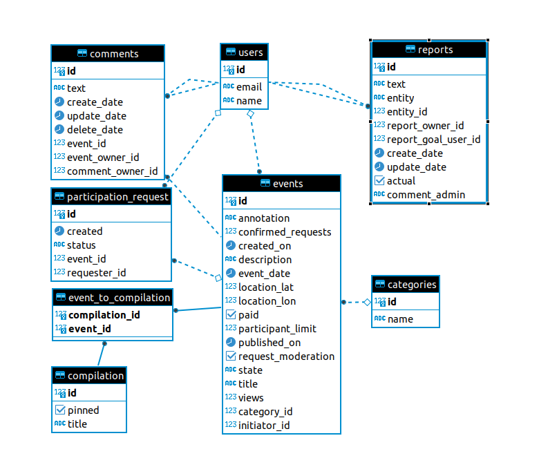

# java-explore-with-me
___
### Pull request для ревью можно найти, нажав [*__тык__*](https://github.com/LVarf/java-explore-with-me/pull/37). 
___
### Описание проекта
Приложение, находящееся в данном репозитории, является реализацией дипломного проекта по курсу Java - разработка на 
платформе [__Яндекс.Практикум__](https://practicum.yandex.ru/).  
Идея диплома - афиша, где можно предложить какое-либо событие от выставки
до похода в кино и набрать компанию для участия в нём.

Проект с микросервисной архитектурой реализован на платформе Spring Boot с использованием
Spring Data JPA, Hibernate и других библеотек.  
База данных - PostgreSQL.
#### Структура
* основной микросервис: __ewm-core__;
* микросервис статистики: __ewm-stat__;
* база данных для основного сервиса (схема базы данных представлена в конце документа);
* база данных для сервиса статистики (схема базы данных представлена в конце документа);
___
### Запуск проекта в контейнере
1. Сколнировать проект из ветки *developer* в локальный репозиторий командой "git clone *__actual_link__*".
2. Открыть терминал в корневой директории "java-explore-with-me".
3. Выполнить команду "docker compose up -d".
___
### Схемы баз данных
#### Основной микросервис

#### Микросервис статистики
